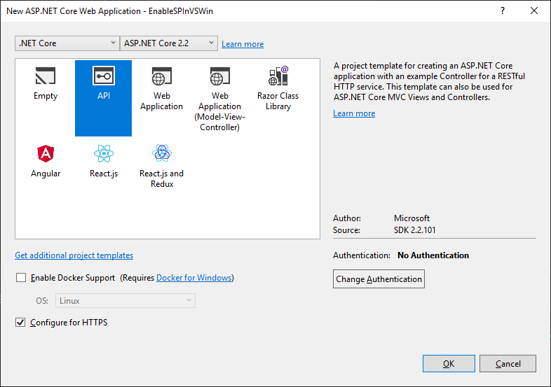
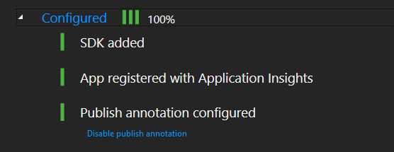
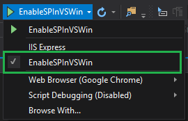

# Enable Application Insights Profiler for ASP.NET Core 2.2 Applications

For Application Insights Profiler 1.1.4-beta1 and above, profiling on Windows is supported as **an experimental feature** for ASP.NET Core 2.2 and above applications.

This document describes how to do it in Visual Studio.

## Create the Project

Create a ASP.NET Core **2.2** WebAPI project, give it a name, for example `EnableSPInVSWin`:



To make it real, make use the following code to add some delay in the controllers to simulate the bottleneck:

```CSharp
private void SimulateDelay()
{
    // Delay for 500ms to 2s to simulate a bottleneck.
    Thread.Sleep((new Random()).Next(500, 2000));
}
```

Reference [ValuesController.cs](./EnableSPInVSWin/Controllers/ValuesController.cs) for full code.

## Enable Application Insights

Enable application insights by using the menu: `Add` | `Application Insights Telemetry ...` and follow the wizard until Application Insights is fully configured:



## Add NuGet package for Application Insights Profiler

Search the NuGet packages using keywords of `Application Insights Profiler`, making sure `Include Prerelease` is checked:


## Enable Application Insights Profiler by code

In [Startup.cs](./EnableSPInVSWin/Startup.cs), add the following code to enable Application Insights Profiler:

```csharp
public void ConfigureServices(IServiceCollection services)
{
    // Add this line to enable Service Profiler
    services.AddServiceProfiler();
    // ...
}
```

## Debugging

Start Debugging the code using **Kestrel**:



Due to [issue#31](https://github.com/Microsoft/ApplicationInsights-Profiler-AspNetCore/issues/31), debugging using **IIS Express** will be supported in the later release (ETA: 1.1.4-beta2).

 You will see logs like it below in the `Output` window:


Now you can [deploy the application to Azure as an app service](https://docs.microsoft.com/en-us/azure/app-service).

## Known issues

* [Issue #31](https://github.com/Microsoft/ApplicationInsights-Profiler-AspNetCore/issues/31): ConvertTraceToEtlxValidator shall follow trace's path to avoid permission issue.

* The trace shown in the Azure Portal is noisy.
